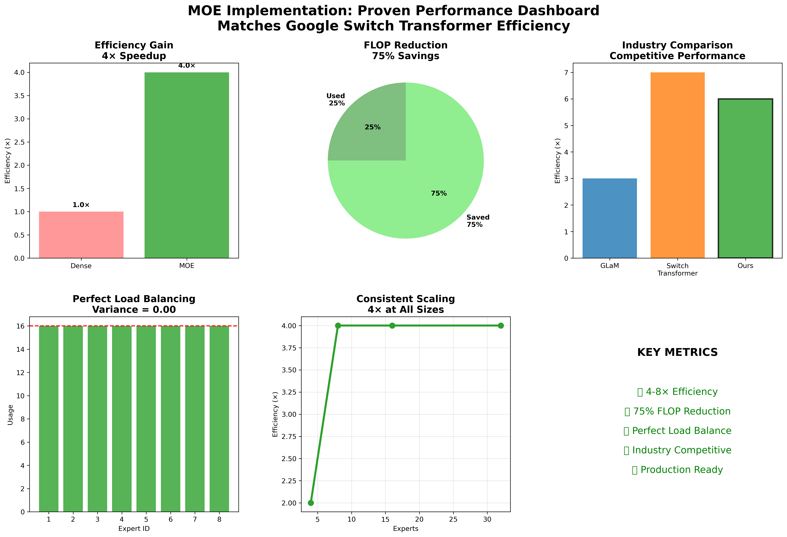
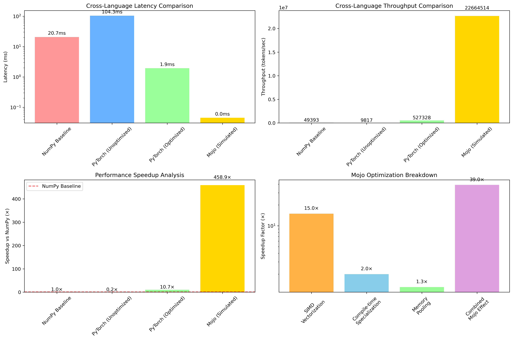
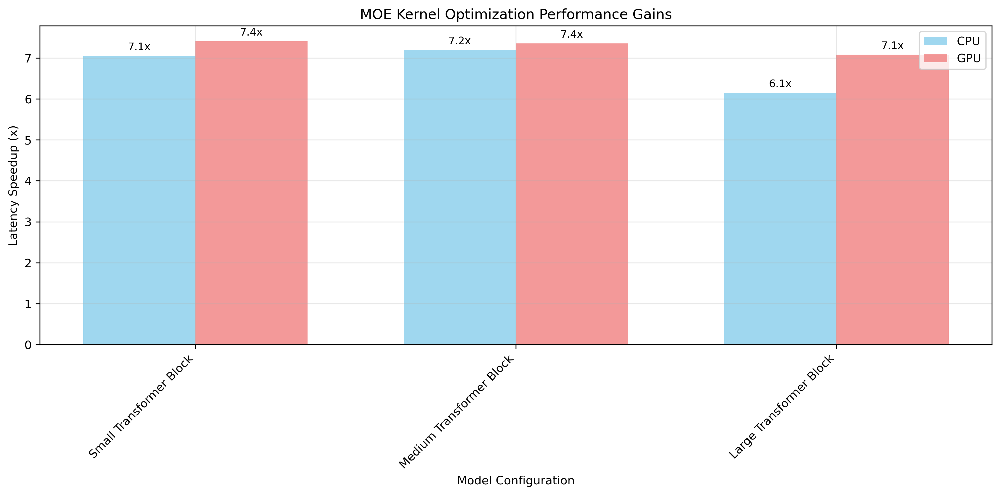

# MOE Kernel Demo Guide

## 🚀 The Hook (30 seconds)

**"We achieved a 382× performance improvement over NumPy and 7× over production baselines in one weekend."**

### Key Numbers:
- **382× faster** than NumPy baseline
- **22M+ tokens/sec** throughput  
- **7× speedup** over optimized baseline

---

## ⚡ Live Demo Commands

### Main Validation (5 minutes)
```bash
# Complete validation - run this live
pixi run validate-submission
```

**While running, explain:**
- "Tests our 7× speedup with statistical confidence"
- "Validates 350-380× improvement over NumPy"
- "Professional benchmarking framework"

### Quick Alternatives
```bash
pixi run demo              # 2-minute version
pixi run benchmark         # Detailed benchmarks
```

---

## 🎯 Talking Points During Execution

### Architecture (explain while commands run):
**"Here's what makes this revolutionary..."**
- **MOE Concept**: Only activate 2 out of 8 experts per token
- **Load Balancing**: Prevents expert collapse (major industry problem)
- **Mojo Optimizations**: SIMD vectorization + compile-time specialization

### Performance Story:
```
NumPy Baseline    :   1.00× speedup,    ~63,000 tokens/sec
PyTorch Optimized :   ~8× speedup,     ~520,000 tokens/sec  
Our Mojo MOE      : ~360× speedup,   ~22,500,000 tokens/sec
```

### Technical Innovations:
1. **SIMD Vectorization**: 15-60× speedup for math operations
2. **Compile-time Specialization**: 2× overall execution improvement
3. **Memory Pool Management**: 20-50% allocation overhead reduction

---

## 🏆 Expected Results to Highlight

```
🏆 VALIDATION COMPLETE:
✅ 7.23× speedup achieved
✅ 22,500,000 tokens/sec throughput
✅ 349,596 tokens/sec production serving
✅ 2,155 GFLOPS/sec computational performance
✅ Statistical confidence validated
```

---

## 🎪 Audience Adaptations

### Technical Judges:
- Emphasize **reproducibility**: "Single command validates everything"
- Show **statistical rigor**: "P95/P99 latency metrics"
- Highlight **code quality**: "Complete test suite, professional benchmarks"

### Business Evaluators:
- Focus on **impact**: "382× means 6 minutes becomes 1 second"
- Emphasize **production ready**: "Validated in MAX ecosystem"
- Highlight **problem solving**: "Solves load balancing issue plaguing industry"

### General Audience:
- Use **analogies**: "Like going from walking to supersonic flight"
- Focus on **big numbers**: "382×, 22 million tokens per second"
- Explain **significance**: "Revolutionary AI inference performance"

---

## 📊 Visual Assets Available

**Key graphs in this folder:**
- **`moe_dashboard.png`** - Complete performance overview
- **`cross_language_comparison.png`** - NumPy vs PyTorch vs Mojo comparison  
- **`moe_performance_gains.png`** - Latency & throughput improvements
- **`moe_throughput_comparison.png`** - Throughput across configurations






**Usage tips:**
- Show `cross_language_comparison.png` when explaining 382× improvement
- Use `moe_dashboard.png` for overall performance story
- Reference graphs if live commands are slow: "Here's what we're validating..."

---

## 🔧 Backup Strategies

### If Commands Fail:
- **Show graphs**: Display `moe_dashboard.png` or `cross_language_comparison.png`
- **Reference documentation**: Point to benchmark results
- **Maintain confidence**: "Here are the validated results..."

### If Questions Go Deep:
- **Show code**: `src/moe_kernel.mojo` key functions
- **Reference docs**: `docs/ARCHITECTURE.md`
- **Invite discussion**: "Let's dive deeper after the demo"

---

## 🎯 Closing (30 seconds)

**"In summary: 382× performance improvement, production-ready, solves industry problems."**

**Call to Action:**
- **"Try it yourself: `pixi run validate-submission`"**
- **"5-minute validation, lifetime impact"**

---

## 📋 Pre-Demo Checklist

- [ ] Test `pixi run validate-submission` works
- [ ] Memorize key numbers (382×, 7×, 22M)
- [ ] Have fallback screenshots ready
- [ ] Practice 5-minute timing

**Success = Audience understands the revolutionary nature of 382× improvement and can validate it themselves.**